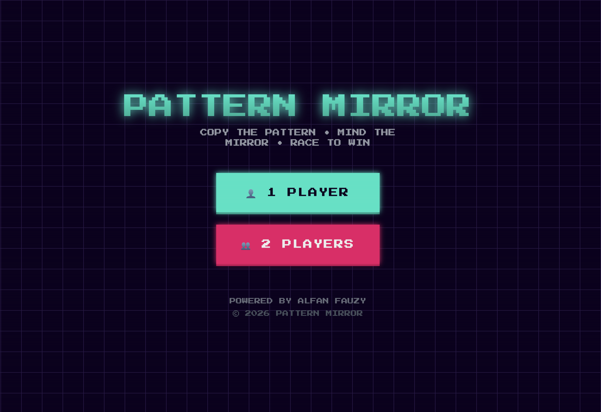
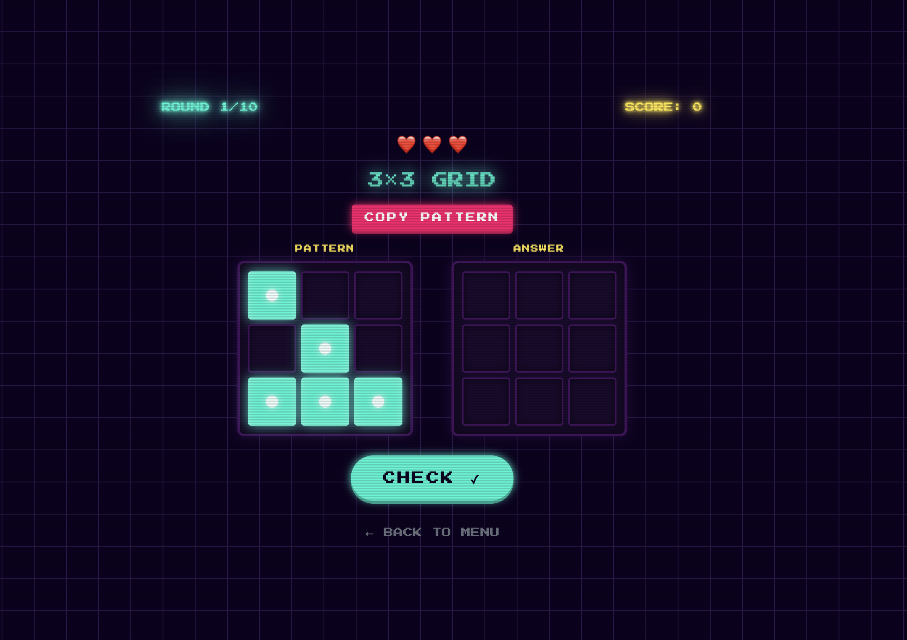

# 🎮 Pattern Mirror

A retro-style memory pattern matching game with a cyberpunk/neon aesthetic. Test your memory skills by copying patterns - but watch out for the mirror mode in later rounds!



## 🕹️ Game Description

**Pattern Mirror** is a memory pattern matching game where players must copy a displayed pattern on a grid. The twist? In later rounds, the pattern is horizontally mirrored! 

### Game Rules

**Single Player Mode:**
- Complete 10 rounds with 3 lives
- Wrong answer = -1 life
- Game over when lives reach 0
- Score +10 points for each correct round

**2-Player Battle Mode:**
- Race to complete 10 rounds first
- Wrong answers slow you down (no lives lost)
- First to finish all rounds wins!

**Mirror Mode:**
- Rounds 8-10 require horizontal mirroring of the pattern
- Adds an extra challenge to test your spatial memory

**Grid Progression:**
- Rounds 1-2: 3×3 grid
- Rounds 3-4: 4×4 grid
- Rounds 5-6: 5×5 grid
- Rounds 7-10: 6×6 grid

## ✨ Features

- 🎯 **Single Player** - Challenge yourself with 10 rounds of increasing difficulty
- ⚔️ **2-Player Battle** - Compete head-to-head in real-time
- 🪞 **Mirror Mode** - Horizontal pattern flipping in later rounds
- 🎨 **Retro Aesthetic** - 80s/90s arcade style with neon glow effects
- 🔊 **Synthesized Audio** - Web Audio API sound effects (no external files)
- 📱 **Responsive Design** - Works on mobile, tablet, and desktop
- ✨ **Smooth Animations** - Cell pulse, appear, shake, and glow effects

## 🎨 Visual Design

### Color Palette

| Name | Hex | Usage |
|------|-----|-------|
| Background | `#0d0221` | Main background |
| Dark | `#1a0b2e` | Card/panel backgrounds |
| Purple | `#45125e` | Borders, accents |
| Pink | `#ff006e` | Secondary buttons, errors |
| Cyan | `#00f5d4` | Primary buttons, highlights |
| Yellow | `#fee440` | Score, warnings |
| Green | `#00bb9f` | Success states |
| Red | `#ff3333` | Danger/loss |

### Typography

- **Font:** Press Start 2P (Google Fonts) - pixel art style
- **Effects:** Neon glow text with multiple text-shadows
- **Scanlines:** CSS repeating gradient overlay for retro CRT effect

## 🖼️ Screenshots

### Main Menu


### Single Player Mode


### 2-Player Battle Mode


## 🚀 Getting Started

### Prerequisites

- Node.js 18+ 
- npm or yarn

### Installation

```bash
# Clone the repository
git clone <repository-url>
cd memory-training-game

# Install dependencies
npm install

# Start development server
npm run dev
```

### Build for Production

```bash
npm run build
```

### Preview Production Build

```bash
npm run preview
```

## 🛠️ Tech Stack

- **Framework:** React 19
- **Language:** TypeScript
- **Build Tool:** Vite
- **Styling:** Tailwind CSS
- **UI Components:** Radix UI primitives
- **Icons:** Lucide React
- **Sound:** Web Audio API (synthesized)

## 📁 Project Structure

```
my-app/
├── index.html
├── package.json
├── tsconfig.json
├── vite.config.ts
├── tailwind.config.js
├── postcss.config.js
├── public/
│   └── image/
│       ├── ss-1.png
│       ├── ss-2.png
│       └── ss-3.png
├── src/
│   ├── main.tsx
│   ├── App.tsx
│   ├── App.css
│   ├── index.css
│   ├── components/
│   │   └── ui/           # Reusable UI components
│   ├── hooks/
│   │   └── use-mobile.ts
│   ├── lib/
│   │   └── utils.ts
│   └── utils/
│       └── sound.ts      # Web Audio API sound manager
```

## 🔊 Sound Effects

All sounds are synthesized in real-time using the Web Audio API:

| Event | Sound |
|-------|-------|
| Menu button click | 440Hz sine wave, 0.1s |
| Cell click | 880Hz square wave, 0.05s |
| Correct answer | Ascending C major arpeggio |
| Wrong answer | Descending sawtooth buzz |
| Victory | Fanfare melody |
| Game Over | Sad descending tones |

## 📱 Responsive Breakpoints

- **Mobile:** < 640px (single column, smaller grids)
- **Tablet:** 641px - 1023px (adjusted spacing)
- **Desktop:** > 1024px (full 2P side-by-side layout)

## 🎮 How to Play

1. **Select Game Mode** - Choose between Single Player or 2-Player Battle
2. **Memorize the Pattern** - Look at the pattern displayed on the left grid
3. **Copy the Pattern** - Click cells on the right grid to replicate the pattern
4. **Check Your Answer** - Click the "CHECK" button to verify
5. **Beware of Mirror Mode** - In rounds 8-10, the pattern is horizontally flipped!

## 👨‍💻 Author

**Alfan Fauzy** - [@oceanspacetec](https://instagram.com/oceanspacetec)

## 📄 License

© 2026 Pattern Mirror. All rights reserved.

---

*Built with ❤️ using React, TypeScript, and Vite*
